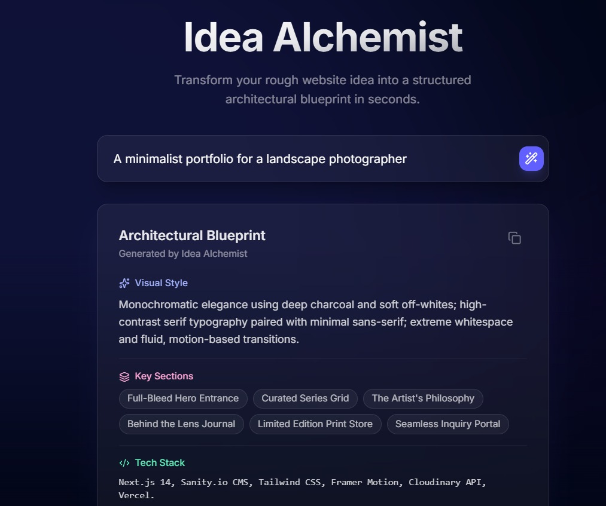

# ✨ Idea Alchemist

**Transform your rough website ideas into structured architectural blueprints in seconds.**

Idea Alchemist is a high-performance, aesthetically driven "Vibe Coding" project built with the latest web technologies. It uses AI to analyze a user's description and generate a visual style, key sections, and a recommended tech stack for their next big project.



## 🚀 Experience the Magic

- **Deep Dark Aesthetic**: A sleek `bg-slate-950` theme with glowing, breathing mesh gradients.
- **Glassmorphism UI**: High-end `backdrop-blur-md` cards with subtle, calibrated borders.
- **AI-Powered Architecture**: Integrated with Google Gemini to provide real, structured insights.
- **Motion Design**: Smooth layout transitions and staggered micro-animations powered by Framer Motion.

## 🛠️ Tech Stack

- **Framework**: [Next.js 15+ (App Router)](https://nextjs.org/)
- **Language**: [TypeScript](https://www.typescriptlang.org/)
- **Styling**: [Tailwind CSS 4](https://tailwindcss.com/)
- **Animation**: [Framer Motion](https://www.framer.com/motion/)
- **Icons**: [Lucide React](https://lucide.dev/)
- **AI Strategy**: [Google Generative AI (Gemini)](https://ai.google.dev/)

## 🏁 Getting Started

### 1. Prerequisites
- Node.js 18.x or later
- An active [Google AI Studio API Key](https://aistudio.google.com/app/apikey)

### 2. Installation
Clone the repository and install dependencies:
```bash
npm install
```

### 3. Environment Setup
Create a `.env.local` file in the root directory and add your Gemini API Key:
```env
GEMINI_API_KEY=your_actual_api_key_here
```

### 4. Run the Development Server
```bash
npm run dev
```
Open [http://localhost:3000](http://localhost:3000) with your browser to see the result.

## 📁 Project Structure

- `src/app/api/generate`: Backend route handling the Gemini AI logic.
- `src/components/hero-section.tsx`: Main state machine for the lander.
- `src/components/ui`: Reusable high-fidelity components (GlassInput, ResultCard).
- `src/lib/utils.ts`: Tailwind CSS merging utilities.

## 🤝 Contribution

Feel free to fork this project, improve the animations, or add more AI capabilities. Let's build something beautiful!

---
*Built with passion for quality and aesthetics.*
